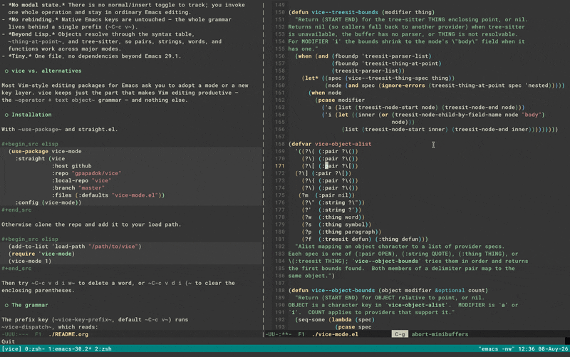

#+title: vice
#+author: Giorgos Papadokostakis
#+date: 2024-02-21

[[https://github.com/gpapadok/vice/actions/workflows/test.yml][https://github.com/gpapadok/vice/actions/workflows/test.yml/badge.svg]]
# Uncomment once vice-mode is on MELPA:
# [[https://melpa.org/#/vice-mode][https://melpa.org/packages/vice-mode-badge.svg]]

~vice~ (VIm-like Commands Extension for Emacs) brings Vim's composable
"operator + text object" editing to Emacs without modal state. Instead
of one command per key, it reads a whole operation from a single prefix
and multiplies a small set of operators by a small set of text objects.

It adds on top of the vanilla Emacs navigation flow without revamping
Emacs keybinds.

** Why vice

- *Composable.* A few operators times a few text objects give many
  commands, with nothing to memorize per command — just the grammar.
- *No modal state.* There is no normal/insert toggle to track; you invoke
  one whole operation and stay in ordinary Emacs editing.
- *No rebinding.* Native Emacs keys are untouched — the whole grammar
  lives behind a single prefix (~C-c v~).
- *Beyond Lisp.* Objects resolve through the syntax table,
  ~thing-at-point~, and tree-sitter, so pairs, strings, words, and
  functions work across major modes.
- *Tiny.* One file, no dependencies beyond Emacs 29.1.

** vice vs. alternatives

Most Vim-style editing packages for Emacs ask you to adopt a mode or a new
key layer. vice keeps just the part that makes Vim editing productive —
the ~operator + text object~ grammar — and nothing else.

** Installation

With ~use-package~ and straight.el.

#+begin_src elisp
  (use-package vice-mode
    :straight (vice
               :host github
               :repo "gpapadok/vice"
               :local-repo "vice"
               :branch "master"
               :files (:defaults "vice-mode.el"))
    :config (vice-mode))
#+end_src

Otherwise clone the repo and add it to your load path.

#+begin_src elisp
  (add-to-list 'load-path "/path/to/vice")
  (require 'vice-mode)
  (vice-mode 1)
#+end_src

Then try ~C-c v d i w~ to delete a word, or ~C-c v d i (~ to clear the
enclosing parentheses.

** The grammar

The prefix key (~vice-key-prefix~, default ~C-c v~) runs
~vice-dispatch~, which reads:

#+begin_example
  [count] operator [a|i] object
#+end_example

- ~count~ — an optional repeat, ascending that many levels where the
  object supports it (e.g. nested pairs).
- ~operator~ — what to do.
- ~a~ / ~i~ — /around/ (include the delimiters) or /inside/ (the
  contents only), as in Vim's ~da(~ vs ~di(~.
- ~object~ — what to act on.

~C-g~ aborts at any point. Examples (with the default prefix):

| Keys            | Effect                                      |
|-----------------+---------------------------------------------|
| ~C-c v d a (~   | delete the surrounding parentheses and body |
| ~C-c v d i (~   | delete inside the surrounding parentheses   |
| ~C-c v y i "~   | copy the contents of a string               |
| ~C-c v y a [~   | copy the surrounding brackets and body      |
| ~C-c v 2 d a (~ | delete two levels of enclosing parentheses  |
| ~C-c v d i w~   | delete a word                               |
| ~C-c v = a f~   | reindent the enclosing function             |

*** Operators

From ~vice-operator-alist~:

| Key | Operator                                  |
|-----+-------------------------------------------|
| ~d~ | kill (delete to the kill ring)            |
| ~y~ | save (copy to the kill ring)              |
| ~;~ | comment or uncomment                      |
| ~v~ | select (activate the region)              |
| ~r~ | replace with the head of the kill ring    |
| ~=~ | indent                                    |

*** Objects

From ~vice-object-alist~:

| Key     | Object                                            |
|---------+---------------------------------------------------|
| ~(~ ~)~ | the nearest enclosing parentheses                 |
| ~[~ ~]~ | the nearest enclosing square brackets             |
| ~{~ ~}~ | the nearest enclosing curly braces                |
| ~m~     | the nearest enclosing pair of any type            |
| ~"~ ~'~ | the enclosing string                              |
| ~w~     | a word                                            |
| ~s~     | a symbol                                          |
| ~p~     | a paragraph                                       |
| ~f~     | a function (via tree-sitter, or ~defun~ at point) |

Delimiter and string objects are found with the syntax table, so they
work in any major mode; ~w~/~s~/~p~ use ~thing-at-point~; ~f~ prefers
tree-sitter when a parser is available and falls back to the ~defun~
thing otherwise.

Both members of a delimiter pair select the same object, so ~da)~ and
~da(~ are equivalent.
